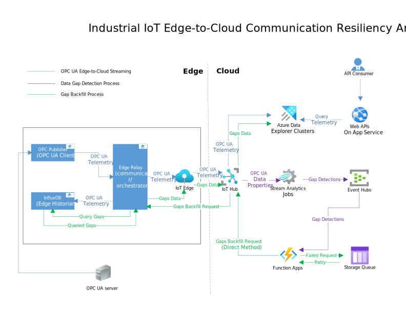
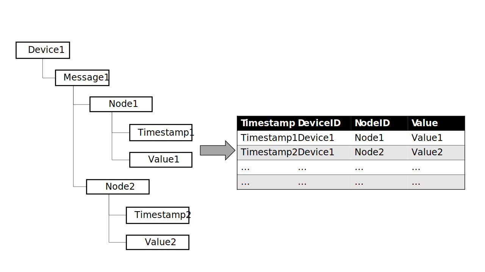
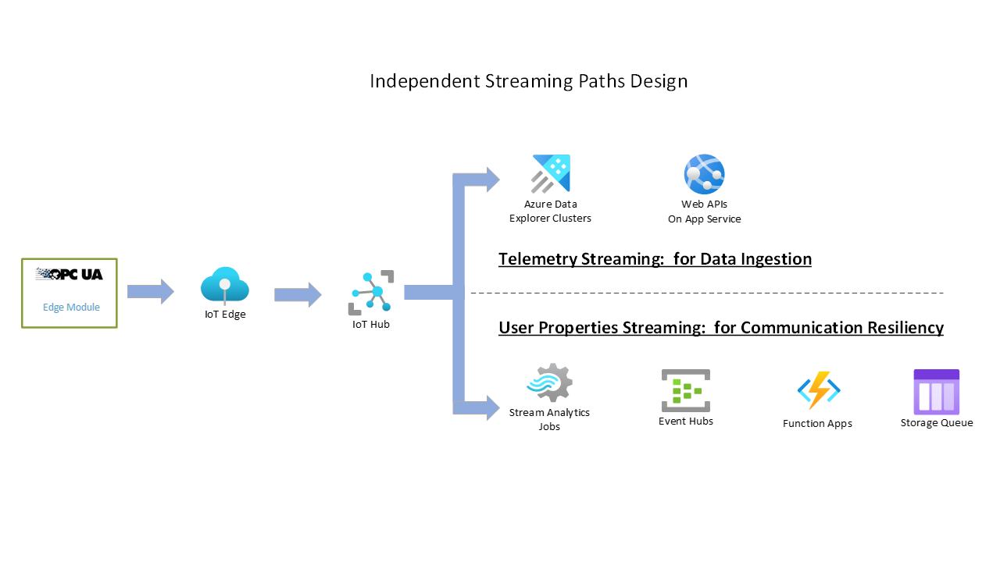
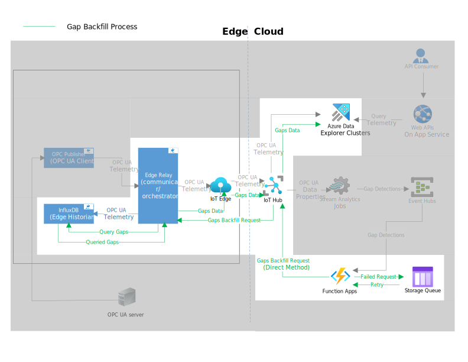

<!-- 
Guidelines on README format: https://review.docs.microsoft.com/help/onboard/admin/samples/concepts/readme-template?branch=master

Guidance on onboarding samples to docs.microsoft.com/samples: https://review.docs.microsoft.com/help/onboard/admin/samples/process/onboarding?branch=master

Taxonomies for products and languages: https://review.docs.microsoft.com/new-hope/information-architecture/metadata/taxonomies?branch=master
-->
# Industrial IoT Edge-to-Cloud Communication Resiliency

## 1. Introduction

From the industrial scenarios we have witnessed, ensuring the resiliency of edge-to-cloud communication is crucial for maintaining data integrity. The data loss during edge-to-cloud communication can lead to serious consequences such as production downtime, equipment damage, and even safety hazards. It can also cause the loss of valuable data for further analysis and decision making.

In Azure IoT Platform, the data transmission from IoT Edge to IoT Hub may experience package loss due to power outages, network disconnections, or hardware failures, etc. While IoT Edge has a built-in retry logic to facilitate data transmission, it alone is insufficient to guarantee the resilience of edge-to-cloud communication. Data loss can occur when the IoT Edge is offline for an extended period, when the IoT Hub experiences throttling, when the IoT Edge is restarted with the persistent network issues, and more. In these various scenarios, the data loss is not recoverable by the built-in retry logic.

Some examples of data loss scenarios include:

- IoT Hub accepts requests above its message traffic throttle for a limited time. However, continuous violation of the throttle leads to a [traffic shaping effect](https://learn.microsoft.com/en-us/azure/iot-hub/iot-hub-devguide-quotas-throttling#traffic-shaping), where the IoT Hub Message queue fills up, resulting in rejected requests and data loss.
- When the IoT Edge is restarted, the messages in the queue on the device will be lost. While the IoT Edge built-in retry feature can help recover some lost data in this case, it's not guaranteed to recover all messages. Unsuccessful retry attempts can occur due to persistent network issues or other factors.
- If the network offline time exceeds the message expiration time configured in the IoT Edge settings, the messages will be considered expired and discarded by the IoT Edge runtime. In such case, the built-in retry feature does not handle expired messages or attempt to resend them once they have exceeded their expiration time.

The adoption of the OPC UA (Unified Architecture) protocol for upstream data transmission poses the same challenges in terms of upstream transmission reliability. The Industrial IoT Edge-to-Cloud Communication Resiliency Solution addresses the resiliency challenges for OPC UA(or any time-series based) data transmission in a hybrid system. It has adopted the concept of the previous Reliable Edge Relay pattern, and is re-architected as a light-weight solution which provides the enhanced flexibility and reduces the operational cost. It features a simplified detection and backfilling logic for easy maintenance.

This solution separates the main telemetry stream for data transmission from the side stream of telemetry properties used for data gap detection and backfilling, making it easily adaptable as a plug-in building block for your pre-built solution without affecting existing upstream data transmission. By reconstructing OPC UA data as time-series based telemetry data, the solution gains extensibility and enables various use cases.

## 2. Business Values

The key business values of the solution include:

- **Flexibility**: The solution offers a high degree of flexibility by separating the main data stream used for data transmission from the side stream of telemetry properties used for data gap detection and backfilling, which allows it to serve as an attachable building block within Azure IoT Edge/IoT Hub platform to enhance edge resiliency in complex systems. It can be seamlessly integrated into existing solutions without disrupting  normal streaming operations. The framework is also designed to support various use cases, including different time-series based telemetry protocols, various sized message batch transmission or single message transmission to enable precise detection accuracy, flexible retry patterns, etc, enabling customization to meet the specific requirements of your project.

- **Simplicity**: The solution provides a simple detection and backfilling architecture as a streamlined and easy-to-maintain solution for edge resiliency.

- **Edge Historian Incorporation**: Edge historian is a common requirement for industrial IoT solution. This asset incorporates InfluxDB as the edge historian for efficient storage and backfilling operations. InfluxDB is a powerful time-series database designed for storing and querying time-series telemetry data. It offers scalability, a flexible data model, and a powerful query language, making it an ideal choice for solutions that rely on time-series data processing.

- **Extensibility**: The solution allows for easy integration of additional features, such as edge AI inference, edge dashboarding with pre-processed OPC UA telemetry, historical data fetching from the edge instead of cloud to bring down the transmission cost, etc. It provides a solid foundation for expanding the functionality of industrial IoT applications.

- **Memory Efficiency**: By leveraging InfluxDB as the local historian, the solution reduces the burden on edge hub memory and improves overall system performance.

- **Cost Efficiency**: Besides the easy-to-maintain design logic and simplify the usage of application services to bring down the operational cost, the solution could be as a generic framework for implementing edge historical data fetching functionality.By fetching historical data from the edge instead of relying solely on cloud storage, it helps reduce the high cost associated with data transmission.

- **Generic for time-series telemetry**: The solution provides a generic framework for handling OPC UA data or any other time-series data. The design concept is independent of specific telemetry protocol and generically based on time-series data principles. It can be easily adapted to other time-series based telemetry protocols.

## 3. Solution Architecture

**Quick Onboard: Go to [Setup and Deployment Guide](./SetupAndDeploymentGuide.md) for a quick run of the sample.**

This solution consists of edge and cloud components that work together to ensure reliable and resilient OPC UA data transmission.

It is capable to detect and backfill the short-time and long-time gaps, and robust with out-of-order telemetries caused during edge-to-cloud data transmission.

The Architecture of the solution is illustrated as below:


### 3.1 Edge: OPC UA Edge Processing and Backfill with Local Historian

The edge component of the solution performs two main functions:

1. OPC UA Reconstruction and Processing: The OPC UA data hierarchy is reconstructed into flattened time-series telemetry data for local storage and edge-to-cloud streaming. The Edge Relay module reconstructs the OPC UA structure and store the telemetry data to local historian. After ensuring the local storage success, then it batches the data with configurable batch sizes and streams the batches to IoT Hub at configurable time intervals.

2. Edge Historian: InfluxDB serves as the local historian for storing telemetry data and handling backfill operations. The Edge Relay module saves the telemetries to InfluxDB for later the data query and backfilling operations. Edge Relay module handles the backfill operation by querying the data within a desired time frame window from InfluxDB and send it to IoT Hub in a same way as the telemetries edge-to-cloud upstream transmission. See [Section 3.3 Backfill Operation Design](#33-backfill-operation-design) for more details.

In addition, the Edge Relay module in this sample also handles the data gap simulation by skipping a data batch once a `SkipMessageMethod` Direct Method request is invoked from IoT Hub, so that to test and demonstrate the backfill operation.

#### 3.1.1 OPC UA Reconstruction

The OPC UA reconstruction method is depends on the specific OPC UA data structure in your use case.
In this sample, we are using Azure OPC PLC Server to simulate the OPC UA data source. The OPC UA data in the demo sample has the hierarchy structure with the following levels as shown below, and the OPC UA data is reconstructed as the flattened time series telemetries for edge-to cloud data transmission and storing. This reconstruction process is specific to the OPC UA data structure used in the given use case, and is illustrated as below.



#### 3.1.2 InfluxDB as Edge Historian

InfluxDB is a powerful time-series database that is well-suited for storing and querying time-series telemetries data in a time-series processing based solution. In this solution, we are using InfluxDB as the edge historian to store the telemetries data locally and handle the backfill operation.

- **Why Choose InfluxDB for This Use Case**
  - Designed for Time-Series Data: InfluxDB is purpose-built to efficiently handle time-series data, providing optimized storage and querying capabilities.

  - Scalability: InfluxDB is designed to handle large volumes of time-series data with ease, making it suitable for high-throughput environments where real-time processing and analysis of telemetries data are required.

  - Flexible Data Model: InfluxDB's data model allows for flexible schema design, enabling easy tagging and querying of telemetries data based on various dimensions, such as device ID, sensor type, and timestamp.

  - Powerful Query Language: InfluxDB provides a rich query language (InfluxQL) that supports a wide range of functions and operators for filtering, aggregating, and analyzing time-series data. This increase the extensibility of this asset to allows for complex queries and real-time analytics on OPC UA telemetries data at the edge. see [Section 5 Extensibility](#5-extensibility) for extensibility use cases.

- **InfluxDB Client Library**

  To interact with InfluxDB, the InfluxDB client library [AdysTech.InfluxDB.Client.Net](https://github.com/AdysTech/InfluxDB.Client.Net) is used in this sample. This .NET client library provides a convenient and straightforward way to connect to an InfluxDB instance, send telemetries data, and perform queries.

  Alternatively, you can explore other client options available for interacting with InfluxDB, such as InfluxDB's official client libraries for various programming languages, including Python, Java, and Go. These libraries offer similar functionality and can be chosen based on your preferred programming language. See the [InfluxDB documentation](https://docs.influxdata.com/influxdb/v1.8/tools/api_client_libraries/) for more information.

- **InfluxDB Configuration and Data Mapping for OPC UA telemetries**
  
  For an efficient storing and querying of reconstructed OPC UA telemetries messages with InfluxDB, a proper configuration for InfluxDB connection, retention policy, and data mapping is required.

  In this sample, OPC UA telemetries messages contain properties such as timestamp, device ID, node ID, and telemetries value as in [Section 3.1.1 OPC UA Reconstruction](#311-opc-ua-reconstruction). These properties are mapped to InfluxDB measurements, tags, and fields, to enable efficient storage and querying of telemetries data.

  To implement the data mapping for your specific OPC UA telemetries messages or time-series messages, and other configuration settings for InfluxDB, refer to the code sample's Setup_and_Deployment_Guide file which provides detailed instructions and links on how to configure the mapping using the InfluxDB client library.

### 3.2 Cloud: Gap Detection Algorithm and Streams Separation

The cloud component of the solution focuses on detecting communication gaps caused by the edge-to-cloud data transmission, telemetry data ingestion, and cloud side backfill invocation design. Please see [Section 3.3 Backfill Operation Design](#33-backfill-operation-design) for end-to-end backfill operation. This section will describe the gap detection algorithm and the separation of telemetry streams for gap detection and actual cloud data storage.

#### 3.2.1 Gap Detection Algorithm

The gap detection algorithm is done by Azure Stream Analytics(ASA) to detect and filter the actual data gap in a case of either short-time or long-time gaps, and in the consideration of  out-of-order telemetries received at the cloud. The gap scenario and the algorithm are illustrated as below:


In the detection stream, the data user properties streamed into ASA and used for gap detection purpose include:

- **DeviceID**: device stream identifier
- **Batch_start_time_window** and **Batch_end_time_window**: each batch has its start time window and end time window used for detecting if a actual gap happens. In the above illustrated example, the batch 1 has its start time window as T1 and end time window as T2, and the batch 2 has its start time window as T2 and end time window as T3.
- **First_message_timestamp_In_Batch** and **Last_message_timestamp_In_Batch**: The first message's timestamp in the current batch and the last message's timestamp in the previous batch are used for calculating the total time duration of the detected gap. In the above illustrated example that a gap between batch 1 and batch 6 is detected in ASA, and the gap duration is calculated by the difference of the last message msgN's timestamp in batch 1 and the first message msg1's timestamp in batch 6.

The detection method for the actual gap in ASA is implemented with the below logic:

```text
curr_start_T = current_batch_start_time_window
prev_end_T = previous_batch_end_time_window
prev_last_msg_ts = previous_batch_Last_message_timestamp
curr_first_msg_ts = current_batch_first_message_timestamp

For each batch arrived in ASA:

        If curr_start_T > prev_end_T          //gap detected
              send [prev_last_msg_ts, curr_first_msg_ts] to Event Hub (for gap backfill invocation)

        If curr_start_T = prev_end_T          // no gap
              send data.meta to meta data storage(for history data query from edge)

        If curr_start_T < prev_end_T          //invalid detection
              drop off from being as a candidate for following comparison (for the case of out-of order or backfilled data, to avoid duplicate detection)

```

#### 3.2.2 Telemetry Streams Separation


There are two paths for the telemetry data egress from IoT Hub to cloud:

- Telemetry Streaming : for data ingestion from the edge and store the actual data in cloud - including the originally streamed data and the backfilled data.

- User Properties Streaming: for gap detection purpose only - the meta data of the originally streamed and the backfilled telemetries.

Separating streams can prevent the case that if the backfilled telemetries go to the same route to ASA, it will be compared again with latest batch telemetries and be drop off from comparison. by putting the data ingestion process to a separate stream, flow to ADX in our case, we can prevent the backfilled data missing, and more importantly to provide the asset's flexibility to be as an easy-to-plug-in component for pre-built solutions with their existing telemetry streaming approach.

For Actual cloud data storage, we select  Azure Data Explorer (ADX) in our sample for the telemetries cloud storage in the cloud. One thing to note is that ADX may store duplicated data in our case. Go to [Section 4.4 Other Consideration](#44-other-consideration) for ADX design consideration.

There are other options for the cloud data storage based on your specific business needs:

- SQL DB: small-sized metadata, BOM data
- Data Lake Storage Gen2: images, historical data zip file
- ADX: telemetries data

More details of cloud data storage selection can be found [here](https://learn.microsoft.com/en-us/azure/data-explorer/data-explorer-overview#when-should-you-use-azure-data-explorer).

### 3.3 Backfill Operation Design

After detected the actual data gap, The backfill operation design aims to retrieve missing telemetry data from the edge historian (InfluxDB) and restore it to the cloud for seamless data continuity.



The design involves the following steps:

1. Once a gap detected and gap event sent to Event Hub, Event Hub will trigger the backfill Azure Function with the gap event.
2. The backfill Azure Function will invoke Direct Method for gap backfill through IoT Hub on the Edge module with the gap's details like deviceID and gap's time range.
3. The Edge Relay Module receives the backfill Direct Method invocation and retrieves the missing telemetry data from the edge historian (InfluxDB) with the gap's time range.
4. The edge module will send the retrieved gap data back to the IoT Hub in the same way of normal telemetry streaming to the cloud.
5. The gap data will be sent to IoT Hub, and IoT Hub egresses the gap data to ADX for cloud telemetry storage.
6. If the backfill request fails in step(3), the Backfill Azure Function will enqueue the failed gap request into the Azure Storage Queue for retry. The Retry Azure Function will then triggered by the failed gap request from the Azure Storage Queue and retry the backfill request until the retry operation is completed according to the retry pattern used.

#### 3.3.1 Backfill Failure Retry

The backfill operation is designed to be a reliable operation. The backfill Azure Function will retry the backfill operation if the backfill request fails. The retry logic could follow the common [Retry Pattern](https://learn.microsoft.com/azure/architecture/patterns/retry) to handle transient failures for the faults those are typically self-correcting. By making the backfill operation a long-running task, the backfill Azure Function continuously polls the edge module to check the status of the backfill operation until it is completed or marked as failed.

To prevent excessive invocations of the backfill operation, a combination of the Retry Pattern and the [Circuit Breaker Pattern](https://learn.microsoft.com/en-us/azure/architecture/patterns/circuit-breaker) can be employed. This helps avoid overwhelming the system with frequent backfill requests.

If you're using C# as the implementation language, one recommended .NET library for implementing patterns such as Retry, Circuit Breaker, and Timeout is [Polly](https://github.com/App-vNext/Polly) .NET libraries. The provided solution sample demonstrates the usage of the Polly library to implement the retry logic with a Retry Pattern. In this sample, the backfill operation is retried three times, with increasing time intervals between each retry, and the retry process stops after reaching the maximum retry count.

For managing the retry queue, Azure Storage Queue is utilized to store the failed backfill requests. The Retry Azure Function works in parallel with the Backfill Azure Function, executing the retry operation from the queue without delaying the normal backfill process.

## 4. Design Considerations

### 4.1 Edge Design Consideration
  
- **Time-series data type**: This solution is based on time-series data principles, ensure your telemetry is time-series data when you design your solution with this pattern.
- **Data securely saved before sending**: This solution is focusing on ensuring resiliency in the message flow from IoT Edge to the Cloud and includes the message path from the relay module to the IoT Edge Hub. However, it does not cover the message flow break from the message publisher to the relay module. Therefore, during the design process, it is crucial to ensure that OPC UA data is securely saved before being sent to the Edge Hub and the cloud. This ensures that all successfully ingested OPC UA data from the publisher is stored and any breaks in the OPC UA streaming to the IoT Edge and cloud can be detected.

- **Data batching**: Batching data is commonly used in real industrial scenarios due to factors such as network efficiency and reducing the overhead of message processing.
However, it's important to design the batch size based on your specific user requirements. Consider the following:
  - If the data volume per second is large, we suggest to design the batch size so that it won't exceed 256KB, the maximum size of a single message that Edge Hub can handle for data transmitting (See more details [here](https://learn.microsoft.com/en-us/azure/iot-hub/iot-hub-devguide-quotas-throttling)). If the batch size is beyond the size limit, the Edge Hub will perform the batching under the cover by itself, which will increase the cost of your design (See more details in [this article](https://techcommunity.microsoft.com/t5/internet-of-things-blog/stretching-the-iot-edge-performance-limits/ba-p/2993856)).
  - If the data volume per second is small, you may consider to batch the data into a smaller size or streaming without batching. The smaller batch size will give a finer grid for the detection accuracy, as the gap will be detected based on each single batch. If there is no batching, the gap will be detected based on each single message.
- **Backfill upstream path**: When backfilled gap messages are sent to the cloud, they should follow the same path as normal telemetry streaming to the cloud. This allows the cloud database to store both types of ingested telemetry data consistently.
- **Edge devices scaling**:

  There are two possible patterns for scaling out edge devices:
  1. Multiple IoT Edge Devices connected to IoT Hub with one OPC UA publisher in each device.
  2. One IoT Edge Devices connected to IoT Hub with one OPC UA publisher, and it's as the gateway with multiple leaf devices with one OPC UA server in each leaf device.

  To adopt the scale-out design (1) which focus on scaling out the first-level IoT Edge devices, it is crucial to ensure that the design incorporates a device ID (device name) associated with each IoT Edge Device and its streamed telemetry. This device ID can serve as the device stream identifier, facilitating the scaling out of the design by enabling proper identification and management of individual edge devices.

  When design for a large scale of edge devices, it is essential to consider the cost implications of Azure Stream Analytics (ASA) for handling the detection part due to the increasing data load. To achieve cost efficiency, it may be beneficial to explore the possibility of using Azure Functions (Az Func) as an alternative to ASA for the detection process.
  
### 4.2 Gap Detection Design Consideration

- **Loss of a single message**: The solution focuses on detecting batch gaps and does not cover the loss of a specific message within a batch. Loss of a message within a batch is considered a purely edge-side issue and is not a result of the hybrid communication process.
- **Timestamp precision**: For scenarios with a large data volume per second, it is advisable to use timestamps with millisecond precision or better to ensure accurate detection of gaps.

### 4.3 Backfill Design Consideration

**Long-hour backfilled data resiliency**: The solution does not address the potential resiliency issues specifically related to backfilled data itself. This becomes particularly significant when dealing with long-hour backfilled data, as the risk of data loss or missing data on the backfilled data increases.

For example, if the on-premises system experiences downtime, resulting in the need to backfill 8 hours of data, the current solution cannot handle gaps in the backfilled telemetry data. This is because Azure Stream Analytics (ASA) will discard the comparison of previously received telemetry data. In such offline downtime cases, the edge side should prioritize data resiliency over the cloud.

If your use case requires ensuring resiliency in backfilled telemetry data, it may be necessary to duplicate another set of ASA to handle the resiliency of the backfilled messages specifically.

### 4.4 Other Consideration

**Duplicate records in ADX**: Duplicate telemetry records may be received in ADX. This is not an uncommon situation in many cloud data aggregation scenarios and sometimes is ignorable. However, if you have a specific application use case that might be affected by duplicate records, you can find the common options to mitigate this [here](https://learn.microsoft.com/en-us/azure/data-explorer/dealing-with-duplicates).

## 5. Extensibility

The solution offers the extensibility to incorporate additional features and enhance its functionality. Some of the potential extensions and features that can be integrated into the solution are:

- **Edge AI Inference**: By leveraging the pre-processed OPC UA telemetry data, the solution can be extended to support edge AI inference and monitoring. Edge devices equipped with AI capabilities can perform real-time analytics and decision-making at the edge, reducing latency and bandwidth usage by avoiding frequent data transmission to the cloud. This extension opens up possibilities for intelligent edge applications, such as predictive maintenance, anomaly detection, and optimization of industrial processes.
- **Edge Dashboarding**: The solution's design allows for the creation of edge dashboards using pre-processed OPC UA telemetry data. Edge dashboards provide real-time visualization of operational metrics, enabling operators and engineers to monitor and analyze data locally. This extension enhances situational awareness, facilitates quick decision-making, and reduces the reliance on cloud-based visualization tools.
- **Edge-based Historical Data Retrieval**: To reduce the expenses associated with data transmission, the solution can be expanded to retrieve historical data directly from the edge instead of relying solely on cloud storage for accessing older data. By utilizing the local historian capabilities offered by InfluxDB, historical telemetry data can be efficiently obtained from the edge when required. This extension promotes cost efficiency by minimizing the need for data transmission and offers an alternative method for accessing historical data, facilitating analysis and reporting tasks.

## Related Readings

- [Stretching the IoT Edge performance limits - Microsoft Community Hub](https://techcommunity.microsoft.com/t5/internet-of-things-blog/stretching-the-iot-edge-performance-limits/ba-p/2993856)
- [Process and manage data on Azure](https://microsoft.github.io/PartnerResources/azure/iot/assets/05ProcessAndManageData)
- [Retry pattern](https://learn.microsoft.com/en-us/azure/architecture/patterns/retry)
- [Circuit Breaker pattern](https://learn.microsoft.com/en-us/azure/architecture/patterns/circuit-breaker)
- [Handle duplicate data in Azure Data Explorer](https://learn.microsoft.com/en-us/azure/data-explorer/dealing-with-duplicates)
