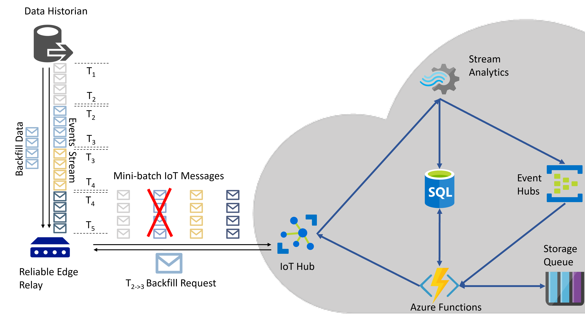
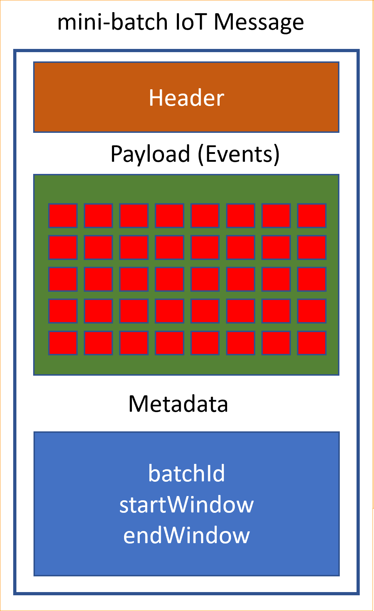
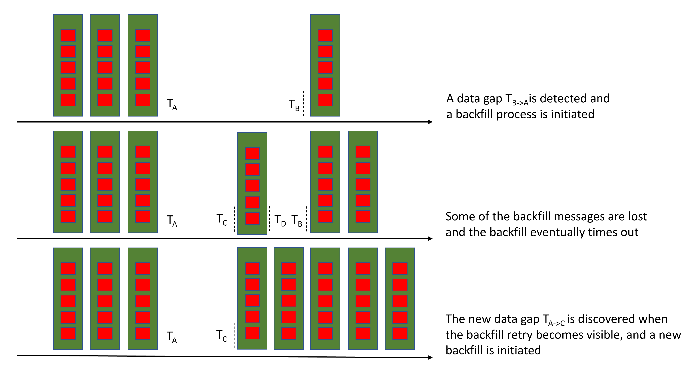

<!-- 
Guidelines on README format: https://review.docs.microsoft.com/help/onboard/admin/samples/concepts/readme-template?branch=master

Guidance on onboarding samples to docs.microsoft.com/samples: https://review.docs.microsoft.com/help/onboard/admin/samples/process/onboarding?branch=master

Taxonomies for products and languages: https://review.docs.microsoft.com/new-hope/information-architecture/metadata/taxonomies?branch=master
-->

# IoT Reliable Edge Relay

## Problem Statement

Today we witness many legacy on-premise data sources that are being actively used in production and with no lift-and-shift cloud migration option. In these cases, the data communication happens through a custom connection adapter, which can be easily reused in an IoT Edge application. This Edge application can then act as an Azure upstream communication relay and move the data stream to the upstream.

As with any other on-premise applications, this Edge Relay suffers too from the same reduced reliability. Power outages, network disconnections or hardware failures, all contribute to this low upstream communication reliability, which in turn is translated to data loss.

## Reliable Upstream Communication Protocol

A new communication protocol is required to enable this reliable upstream communication. In most legacy streaming data sources, an out-of-bound backfill mechanism exist, where the caller can request and get a specific window of missing data. This protocol leverages the temporal nature of the data and this backfill mechanism to automate the data gap detection and the backfill process of the detected data gaps, in a cloud native and abstract way that is transparent from the application layer.

## Reference Implementation Architecture

The high level architecture of this reference implementation is depicted below.

## Data index

The data gap detection mechanism of this protocol assumes that a data ordering index exists, based on which data windows of unambiguous start and end can be defined. For example, this index could be the events timestamp or any auto-increment property. In this reference implementation, we assume that the events are temporally sortable, and the data windows are defined by start and end timestamps.

## Edge mini-batch aggregation and IoT Messages

The events flowing in the Edge Relay are being aggregated into mini-batches and each mini-batch is sent to the upstream as a single IoT Message. The maximum size of an IoT Message is 256KB. The payload is application specific, but in general is an array of the on-premises data source stream events.
When the event aggregation is complete, the startWindow, endWindow and batchId metadata properties are added and the message is sent to the upstream. The start and end window are the values of the data index that define the duration of the aggregation. It is assumed that for any **consecutive** messages Tn and Tn+1, it is **Tn.EndWindow == Tn+1.StartWindow**.
The batchId can be used as a stream identifier.

### Data Gap Detection

To detect the data gaps, we simply examine every IoT message metadata and it's previous message and expect the **Tn.EndWindow == Tn+1.StartWindow** to be true, per batchId.
This reference implementation relies on the [LAG](https://docs.microsoft.com/en-us/stream-analytics-query/lag-azure-stream-analytics) Azure Stream Analytic analytic operator.

Because of out-of-order messages, a detected data gap is possible to be filled by the upcoming messages immediately after the detection. For this reason, a delay Ddetection between the detection to the backfill is introduced.

### Backfill process

For every detected data gap, a backfill process will eventually be triggered, requesting the missing data from the Edge Relay. To determine the actual data gaps, this process will examine the recorded IoT Messages metadata. This is the authoritative source of information of the successfully delivered data, and for this implementation, a SQL database was used.

Because a data gap might be already in the process of being backfilled, to avoid duplicate data we use a second store to record the existing backfill requests. If a data gap is detected and there is a pending backfill request, no new backfill is generated. This helps to absorb any irregularities in the backfill process and avoid possible race conditions.

The backfilled IoT Messages metadata contain another property that flags the data as backfill data to avoid false data gap detections.

### Backfill Retries

A backfill process has also an expiry time, here set to three hours. This helps ensuring that a backfill request will be eventually retried, if the last request expired without successfully backfilling the missing data. The way to ensure that a failed backfill will be retried is by using a backfill request queue with invisibility timeout, like Azure Storage Queues.

Every time a backfill request is sent to the Edge Relay, a message is enqueued in the Storage Queue that becomes visible, **after** the backfill expires.

### Edge Relay

The Edge Relay interface is simple and abstracted from the application layer. Besides the added metadata information, a direct method interface is required to trigger the collection of the missing data from the on-premises data source. The backfilled data will be eventually pushed in the same upstream channel, as they are being collected.

## Contents

Outline the file contents of the repository. It helps users navigate the codebase, build configuration and any related assets.

| File/folder       | Description                                |
|-------------------|--------------------------------------------|
| `ArmTemplate`             | The Arm Template to provision the required Azure artifacts.                        |
| `DemoEdgeApp`             | The Demo IoT Edge Application in .NET Core that is used to simulate the actual Edge application.                        |
| `GapBackfill`             | The Azure Functions that monitor, detect and back-fill the upstream data gaps.                        |
| `.gitignore`      | Define what to ignore at commit time.      |
| `CONTRIBUTING.md` | Guidelines for contributing to the sample. |
| `README.md`       | This README file.                          |
| `LICENSE`         | The license for the sample.                |

## Prerequisites

Outline the required components and tools that a user might need to have on their machine in order to run the sample. This can be anything from frameworks, SDKs, OS versions or IDE releases.

## Setup

Explain how to prepare the sample once the user clones or downloads the repository. The section should outline every step necessary to install dependencies and set up any settings (for example, API keys and output folders).

## Running the sample

Outline step-by-step instructions to execute the sample and see its output. Include steps for executing the sample from the IDE, starting specific services in the Azure portal or anything related to the overall launch of the code.

## Key concepts

Provide users with more context on the tools and services used in the sample. Explain some of the code that is being used and how services interact with each other.

## Contributing

This project welcomes contributions and suggestions.  Most contributions require you to agree to a
Contributor License Agreement (CLA) declaring that you have the right to, and actually do, grant us
the rights to use your contribution. For details, visit https://cla.opensource.microsoft.com.

When you submit a pull request, a CLA bot will automatically determine whether you need to provide
a CLA and decorate the PR appropriately (e.g., status check, comment). Simply follow the instructions
provided by the bot. You will only need to do this once across all repos using our CLA.

This project has adopted the [Microsoft Open Source Code of Conduct](https://opensource.microsoft.com/codeofconduct/).
For more information see the [Code of Conduct FAQ](https://opensource.microsoft.com/codeofconduct/faq/) or
contact [opencode@microsoft.com](mailto:opencode@microsoft.com) with any additional questions or comments.
