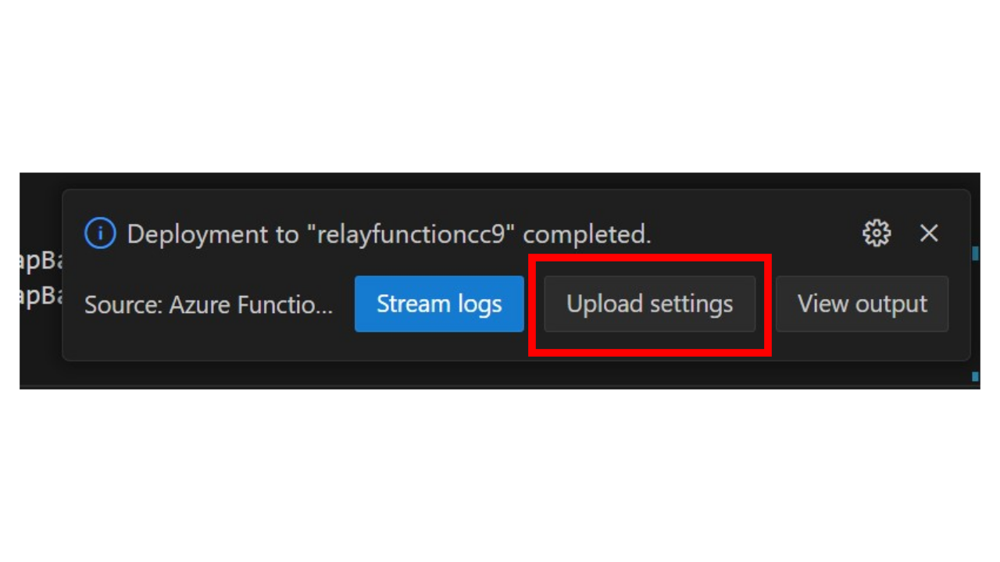

# Setup and Deployment Guide

## 1. Repository Contents & Settings

| File/folder       | Description                                |
|-------------------|--------------------------------------------|
| `ArmTemplate`             | The Arm Template to provision the required Azure services.                        |
| `DemoEdgeApp`             | The Demo IoT Edge Application in .NET Core that is used to simulate the actual Edge application.                        |
| `GapBackfill`             | The Azure Functions that back-fill the upstream data gaps.                        |
| `README.md`       | Provides an overview of the solution, including business values, architecture design, technical decisions, considerations, and extensible use cases.                       |
| `SetupAndDeploymentGuide.md`       | This file. It provides instructions for setting up and running the code samples for demonstration purposes.      |
| `.gitignore`      | Define what to ignore at commit time.      |
| `LICENSE`         | The license for the sample.                |

### 1.1 OPC UA Telemetry

#### Message and Batching

The solution demonstrates OPC UA telemetry simulated by Azure OPC PLC server module and published via Azure OPC Publisher module. The original OPC UA messages flowing in the Edge Relay are processed to be flattened time-series messages, and aggregated into data batches. The user properties are added to each batch and the batch is sent to the upstream as a single IoT Message.

The payload of an OPC UA flattened time-series message contains the following information:

- Timestamp
- DeviceID
- NodeID
- Value

The user properties of the message include:

- DeviceID
- Start and end time of the batch
- First message's timestamp and last message's timestamp in a batch, which are used for gap length calculation and data query index

In the provided example, telemetry messages are generated at a frequency of 1 message per second. These messages are grouped into data batches every 2 seconds, and each batch is sent upstream. The batch size and frequency can be configured within the application.

#### Data Query Index

Local historian (influxDB) query index is represented by the start and end time of the gap's time window. The data within the time window will be queried as backfilled data.

The Edge Relay module acts as an orchestrator, handling the Direct Method call for gap backfill requests from the cloud, and to query and retrieve the data with the time window index from local historian.

### 1.2 InfluxDB Configurations

InfluxDB is an open source schemaless time-series database.
It is important to understand the [key concepts of InfluxDB](https://docs.influxdata.com/influxdb/v1.7/concepts/key_concepts/). In this solution we use InfluxDB 1.7.

#### Mapping File

To use InfluxDB 1.7 on Azure IoT Edge in this solution, you need to understand and know how to change the mapping file (TelemetrySelection.json in this solution) and possibly a few options for configuring InfluxDB.
In this sample, we have a sample JSON as what is in TelemetryMessageSample.json:

```json
{
  "timestamp": "1682558141714",
  "deviceID": "opcua1",
  "nodeID": "i=2258",
  "value": "04/27/2023 01:15:41"
}
```

Then the mapping file looks like:

```json
{
  "Databases": [
    {
      "Name": "opcuatelemetry",
      "Measurements": [
        {
          "Name": "telemetry",
          "Tags": [
            {
              "Name": "deviceID",
              "PayloadMapping": "deviceID",
              "AbandonIfEmpty": false
            }
          ],
          "Fields": [
            {
              "Name": "payload",
              "PayloadMapping": "value",
              "Type": "string",
              "AbandonIfEmpty": false,
              "IgnoreIfEmpty": true
            },
            {
              "Name": "nodeID",
              "PayloadMapping": "nodeID",
              "Type": "string",
              "AbandonIfEmpty": false,
              "IgnoreIfEmpty": true
            }
            
          ]
        }
      ],
      "TimestampPayloadMapping": "timestamp"
    }
  ]
}
```

More example of InfluxDB application configurations can be found [here](https://github.com/Azure-Samples/iot-edge-influxdb-grafana/blob/master/documentation/influxdb_README.md).

#### InfluxDB Options

In the InfluxDBRecorder.cs file, we currently configure a retention policy for data of 30 days for all databases. You may want to configure this in ./DemoEdgeApp/.env file depending on your use case. See [InfluxDB Retention Policy](https://docs.influxdata.com/influxdb/v1.7/query_language/database_management/#create-retention-policies-with-create-retention-policy) for more information on available options.

Also note that this currently uses the timestamp in milliseconds while InfluxDB supports precision from nanoseconds up to hour and above, choose the right one for your use case.

## 2. Prerequisites and Setup

This solution consists of three main components:

1. The Azure infrastructure, which you can provision and deploy using the `./ArmTemplate` files. For more information on how to publish an Arm Template you can read [here](https://docs.microsoft.com/en-us/azure/azure-resource-manager/templates/quickstart-create-templates-use-the-portal).

2. The IoT Edge application located in `./DemoEdgeApp` that you can build and publish using VS Code with the IoT Edge extensions. For more information on how to use Visual Studio Code to develop and debug modules for Azure IoT Edge you can read [here](https://docs.microsoft.com/en-us/azure/iot-edge/how-to-vs-code-develop-module).

3. The Azure Functions code located in `./GapBackfill`, which you can build and publish using Visual Studio Code and the Azure Functions extension. For more information on how to use Visual Studio Code to develop, deploy and run Azure Functions at the cloud, you can read [here](https://docs.microsoft.com/en-us/azure/azure-functions/functions-develop-vs-code?tabs=csharp).

## 3. Running the Sample

### Provisioning the solution

Running the sample requires all three above solution components to be in place. The steps for provisioning this solution are in order:

1. Provision the Azure resources using the provided ARM template.

2. Convert the Virtual Machine into an IoT Edge Device and provision it to the IoT Hub. You may follow the guidance [here](https://learn.microsoft.com/en-us/azure/iot-edge/how-to-provision-single-device-linux-symmetric?view=iotedge-1.4&tabs=azure-portal%2Cubuntu).

3. Before deploy the provided Azure functions via Visual Studio Code, update the Storage, EventHub and IoTHub's connection strings in the local.settings.json. Also, configure the IoT Edge Device ID, IoT Relay Module ID, etc in the same file.
After the Function deployment is completed, remember to click "upload settings"  to ensure that the cloud settings are updated.


4. Build and deploy the provided Edge application to the IoT Edge device.

If all goes well, you should be able to see the telemetry flowing throughout the system.

### Simulating the Data Gaps and Invoking the Backfill Operation

In a case of missing batch happens, a backfill request is triggered to the specific device with the missing data time window as the query index.

To simulate a data gap, you'll need to invoke a Relay module Direct Method on the running device. Invoking the `SkipMessageMethod` direct method, the next telemetry data batch will be omitted from sending to the cloud. This in a few seconds will be detected in Azure Stream Analytics and a `BackfillMethod` Direct Method request will be triggered by the running Azure Functions, requesting the missing data from the edge historian.

## Contributing

This project welcomes contributions and suggestions.  Most contributions require you to agree to a
Contributor License Agreement (CLA) declaring that you have the right to, and actually do, grant us
the rights to use your contribution. For details, visit <https://cla.opensource.microsoft.com>.

When you submit a pull request, a CLA bot will automatically determine whether you need to provide
a CLA and decorate the PR appropriately (e.g., status check, comment). Simply follow the instructions
provided by the bot. You will only need to do this once across all repos using our CLA.

This project has adopted the [Microsoft Open Source Code of Conduct](https://opensource.microsoft.com/codeofconduct/).
For more information see the [Code of Conduct FAQ](https://opensource.microsoft.com/codeofconduct/faq/) or
contact [opencode@microsoft.com](mailto:opencode@microsoft.com) with any additional questions or comments.
